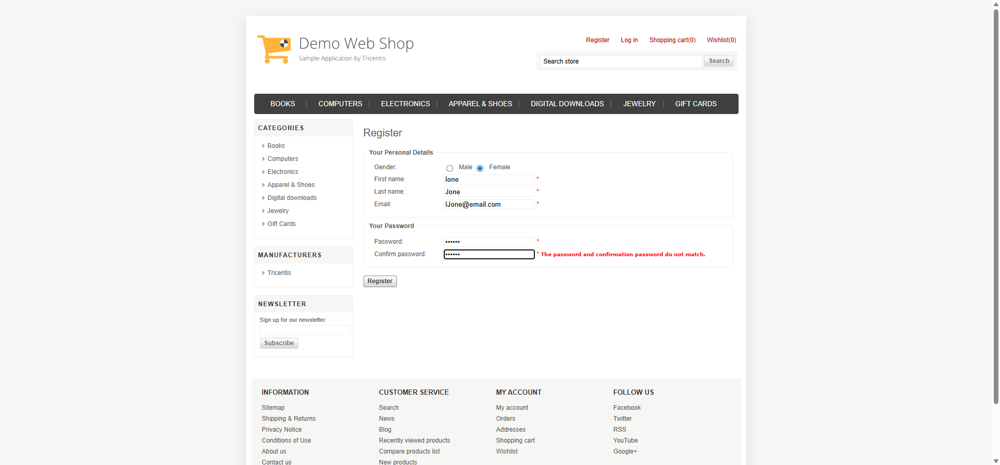
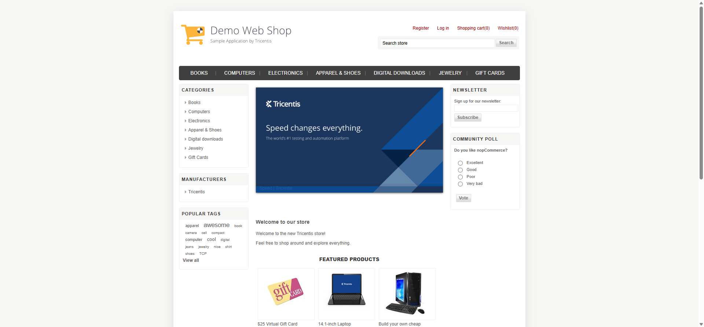
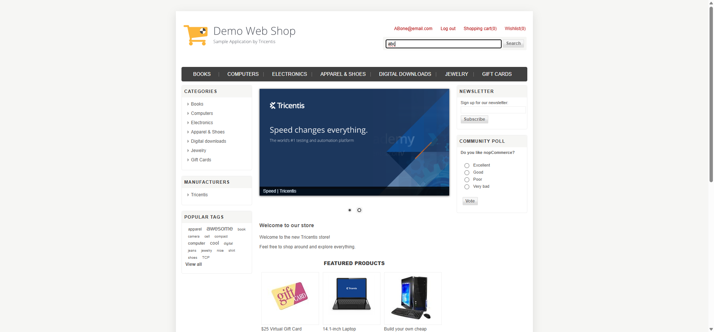

# booknook-sample-automation (Authentication & Product Search)

  

## Project Overview

This project demonstrates a **scalable Selenium + TestNG automation framework** built for an online bookstore. Current scope covers:

* **User Authentication** (Login & Registration)
* **Product Search & Listing**

The framework is designed for **easy extension** to additional features like Cart and Checkout.

## Framework Highlights

* **Page Object Model (POM)** for maintainable and reusable code.
* **BaseTest & Listeners** for centralized test setup and reporting.
* **Retry Mechanism** for handling flaky tests (`Retry.java`).
* **Data-driven testing** using JSON files for various test scenarios.
* **Extent Reports** with screenshots on test execution.
* **Maven & TestNG** integration for easy build and test execution.

## Project Structure

```
src
├─ main/java/com/testautomation/bookstore/pageObjects
│  ├─ HomePage.java
│  ├─ LoginPage.java
│  └─ RegistrationPage.java
├─ main/java/com/testautomation/bookstore/resources
│  ├─ ExtentReporterNG.java
│  └─ GlobalData.properties
└─ test/java/com/testautomation/bookstore
   ├─ data/authenticationData/*.json
   ├─ data/productData/*.json
   ├─ testComponents/BaseTest.java
   ├─ testComponents/Listeners.java
   ├─ testComponents/Retry.java
   └─ tests/AuthenticationTest.java
   └─ tests/ProductSearchTest.java
```

## Setup & Running Tests

1. **Clone the repository**

```bash
git clone https://github.com/<your-username>/booknook-sample-automation.git
cd booknook-sample-automation
```

2. **Install dependencies** (Maven project)

```bash
mvn clean install
```

3. **Run tests using TestNG**

```bash
mvn test
```

4. **View reports**

* Extent Reports: `/reports/index.html`
* TestNG reports: `/test-output/index.html`

## Future Enhancements

* Cart and Checkout flows
* Filter and Sort validations for product listing
* Integration with CI/CD pipelines (Jenkins/GitHub Actions)

## Sample Screenshots

* **Authentication Screenshots:**
  
  
* **Product Search Screenshots:**
  
  
* **Extent Report Snapshot:**
  

## Notes

* This project is for portfolio/demo purposes.
* Focus is on demonstrating **clean automation framework design, data-driven testing, and reporting**.
